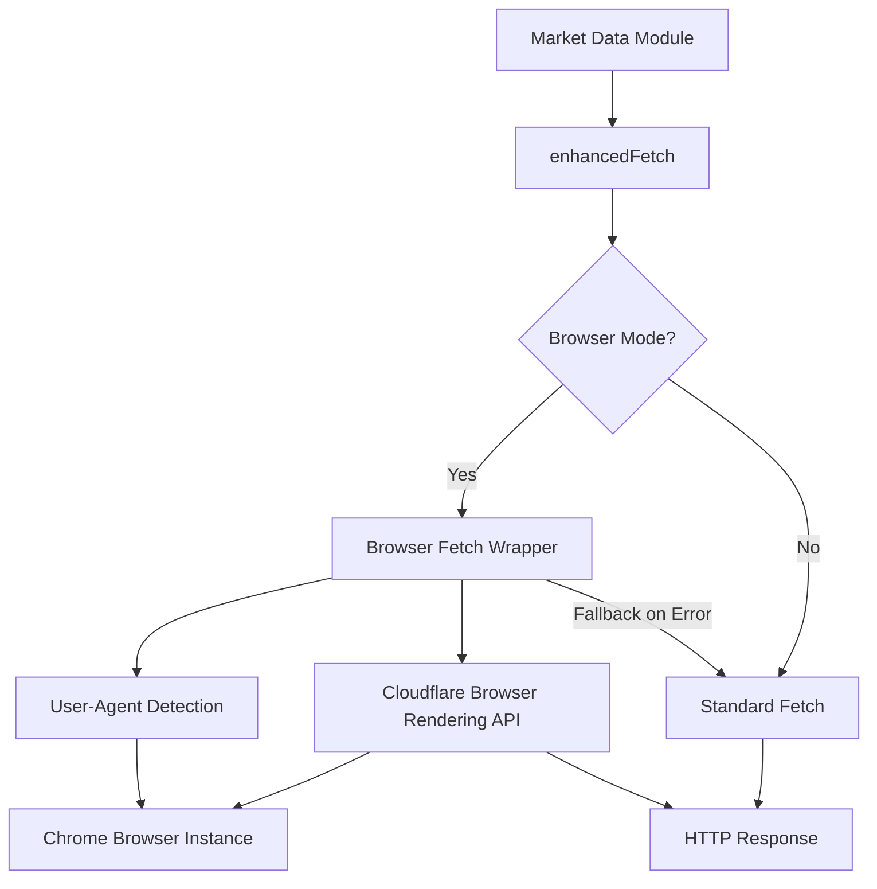

# Design Document

## Overview

This design document outlines the integration of headless Chrome browser automation into the Fear and Greed Telegram Bot. The system will replace standard HTTP fetch requests with Cloudflare Browser Rendering API calls, providing better compatibility with modern web applications while maintaining existing retry and timeout logic. The design ensures automatic user-agent management and graceful fallback to standard HTTP requests when browser automation is unavailable.

## Architecture

The headless Chrome integration will be implemented as an enhancement to the existing `enhancedFetch` utility in `src/utils/fetch.ts`. The architecture follows these principles:

1. **Transparent Integration**: The browser automation layer will be transparent to existing code that uses `enhancedFetch`
2. **Cloudflare-Native**: Use Cloudflare Browser Rendering API for headless Chrome functionality
3. **Graceful Degradation**: Fall back to standard HTTP fetch when browser automation fails or is unavailable
4. **Minimal Changes**: Leverage existing retry, timeout, and error handling infrastructure

### Component Diagram



## Components and Interfaces

### 1. Browser Fetch Wrapper

A new module `src/utils/browser-fetch.ts` will encapsulate browser automation logic:

```typescript
interface BrowserFetchOptions {
  url: string;
  options?: RequestInit;
  timeoutMs?: number;
}

interface BrowserFetchResult {
  response: Response;
  userAgent: string;
}

async function fetchWithBrowser(
  options: BrowserFetchOptions
): Promise<BrowserFetchResult>
```

### 2. Enhanced Fetch Modification

The existing `enhancedFetch` function will be modified to support browser mode:

```typescript
interface EnhancedFetchOptions extends RetryConfig {
  useBrowser?: boolean;  // New option to enable browser mode
}

export async function enhancedFetch(
  url: string,
  options: RequestInit = {},
  retryConfig?: EnhancedFetchOptions
): Promise<Response>
```

### 3. User-Agent Detection

A utility function to detect and format the Chrome version:

```typescript
async function detectChromeUserAgent(
  browser: Puppeteer.Browser
): Promise<string>
```

### 4. Configuration

New environment variables and constants:

```typescript
// In src/constants.ts
export const BROWSER_CONFIG = {
  ENABLED: true,  // Feature flag
  TIMEOUT_MS: 30000,  // Browser-specific timeout
  DEFAULT_USER_AGENT: 'Mozilla/5.0 (Windows NT 10.0; Win64; x64) AppleWebKit/537.36 (KHTML, like Gecko) Chrome/131.0.0.0 Safari/537.36'
};
```

## Data Models

### Browser Context

```typescript
interface BrowserContext {
  browser: Puppeteer.Browser | null;
  userAgent: string;
  version: string;
  initialized: boolean;
}
```

### Browser Error

```typescript
interface BrowserError extends AppError {
  type: 'BROWSER_ERROR';
  browserDetails?: {
    url: string;
    timeout: boolean;
    fallbackUsed: boolean;
  };
}
```

##
Correctness Properties

*A property is a characteristic or behavior that should hold true across all valid executions of a system-essentially, a formal statement about what the system should do. Properties serve as the bridge between human-readable specifications and machine-verifiable correctness guarantees.*

Property 1: Browser headers consistency
*For any* web request made through the browser automation layer, the HTTP headers SHALL include browser-like headers (User-Agent, Accept, Accept-Language, Accept-Encoding)
**Validates: Requirements 1.2**

Property 2: User-agent version matching
*For any* web request made through headless Chrome, the user-agent string SHALL contain the version number that matches the detected Chrome browser version
**Validates: Requirements 2.2**

Property 3: Request logging completeness
*For any* web request made through the system, the log entries SHALL contain the user-agent string used for that request
**Validates: Requirements 2.5**

Property 4: Timeout enforcement
*For any* browser request that exceeds the configured timeout threshold, the system SHALL terminate the request within a reasonable grace period (timeout + 5 seconds)
**Validates: Requirements 3.2**

Property 5: Error logging detail
*For any* browser automation error encountered, the system SHALL log error information that includes the error type, URL, and stack trace
**Validates: Requirements 3.4**

Property 6: Retry with exponential backoff
*For any* retryable browser error, the delay between retry attempts SHALL increase exponentially according to the configured backoff multiplier
**Validates: Requirements 4.1**

Property 7: Fresh context per retry
*For any* failed browser request that is retried, each retry attempt SHALL use a newly created browser context distinct from previous attempts
**Validates: Requirements 4.3**

Property 8: Retry logging completeness
*For any* retry attempt of a browser request, the log entries SHALL include browser-specific error details from the failed attempt
**Validates: Requirements 4.5**

## Error Handling

### Error Categories

1. **Browser Initialization Errors**: Failure to start or connect to headless Chrome
   - Action: Log error, fall back to standard HTTP fetch
   - User Impact: None (transparent fallback)

2. **Browser Timeout Errors**: Request exceeds configured timeout
   - Action: Abort request, apply retry logic
   - User Impact: Potential delay in response

3. **Browser Navigation Errors**: Page fails to load or navigate
   - Action: Log error, retry with fresh context
   - User Impact: Potential delay in response

4. **Version Detection Errors**: Cannot detect Chrome version
   - Action: Use default user-agent, log warning
   - User Impact: None (default user-agent used)

5. **Cloudflare API Errors**: Browser Rendering API unavailable or fails
   - Action: Fall back to standard HTTP fetch
   - User Impact: None (transparent fallback)

### Error Response Format

All browser-related errors will use the existing `AppError` structure with a new error type:

```typescript
{
  type: 'BROWSER_ERROR',
  message: 'Human-readable error message',
  details: {
    url: 'https://example.com',
    timeout: true,
    fallbackUsed: true,
    originalError: '...'
  }
}
```

## Testing Strategy

### Unit Testing

Unit tests will cover:

1. **Browser fetch wrapper initialization**: Test that browser instances are created correctly
2. **User-agent detection**: Test version extraction from browser metadata
3. **Fallback logic**: Test that standard fetch is used when browser mode fails
4. **Error handling**: Test specific error scenarios (timeout, navigation failure, etc.)
5. **Configuration**: Test that feature flags and timeouts are respected

### Property-Based Testing

Property-based tests will use **fast-check** (JavaScript/TypeScript property testing library) to verify:

- Each property-based test will run a minimum of 100 iterations
- Each test will be tagged with the format: `**Feature: headless-chrome-integration, Property {number}: {property_text}**`
- Tests will generate random inputs (URLs, headers, timeout values) to verify properties hold across all valid inputs

Property tests will verify:

1. **Property 1 (Browser headers consistency)**: Generate random URLs and verify all requests include required browser headers
2. **Property 2 (User-agent version matching)**: Generate random requests and verify user-agent contains detected version
3. **Property 3 (Request logging completeness)**: Generate random requests and verify logs contain user-agent
4. **Property 5 (Error logging detail)**: Generate various error conditions and verify log completeness
5. **Property 6 (Retry with exponential backoff)**: Generate retryable errors and verify backoff timing
6. **Property 7 (Fresh context per retry)**: Generate failed requests and verify context uniqueness
7. **Property 8 (Retry logging completeness)**: Generate retry scenarios and verify log details

### Integration Testing

Integration tests will verify:

1. End-to-end market data fetching using browser automation
2. Fallback behavior when browser automation is disabled
3. Compatibility with Cloudflare Workers environment
4. Performance impact of browser automation vs standard fetch

### Testing Tools

- **Unit Tests**: Node.js built-in test runner or Vitest
- **Property-Based Tests**: fast-check library
- **Integration Tests**: Wrangler dev environment with test fixtures
- **Mocking**: Mock Cloudflare Browser Rendering API for local testing
