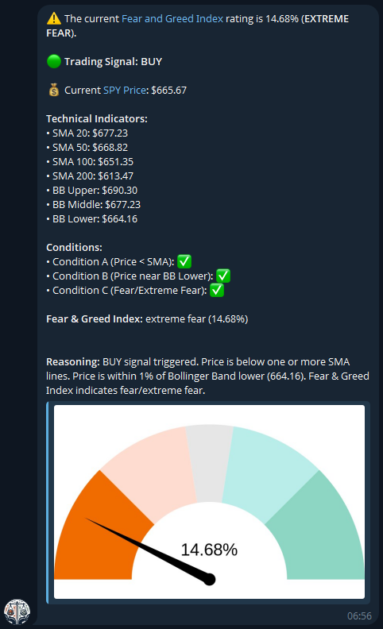

# Fear and Greed Telegram Bot


[](https://github.com/dustfeather/fear-greed-telegram-bot/actions/workflows/deploy.yml)

A Telegram bot that provides automated trading signals based on the Fear and Greed Index and technical indicators. Features personalized watchlists, execution tracking, and automatic position management with BUY/SELL/HOLD recommendations using SMA, Bollinger Bands, and market sentiment analysis.

## Features

- Subscribe to Fear and Greed Index alerts
- Unsubscribe from alerts
- Get the current Fear and Greed Index rating with visual gauge chart
- Trading signal feature: automated buy/sell recommendations based on technical indicators (SMA, Bollinger Bands) and Fear & Greed Index
- Market data integration: fetch price data from Yahoo Finance for any ticker symbol
- Per-user watchlist: manage your own list of tickers to monitor
- Scheduled automatic broadcasts: receive trading signals for all tickers in your watchlist on weekdays
- Bank holiday detection: scheduled jobs automatically skip US stock market holidays (New Year's Day, MLK Day, Presidents' Day, Good Friday, Memorial Day, Juneteenth, Independence Day, Labor Day, Thanksgiving, Christmas)
- Market closed notices: manual requests on holidays include a notice that markets are closed
- Per-user execution tracking: record and view your trading signal executions with optional date parameter
- Active position tracking: automatically tracks open positions and adjusts signals accordingly
- Trading frequency limits: calendar month-based restrictions (once per month)
- Color-coded signal indicators: 🟢 BUY, 🟡 HOLD, 🔴 SELL
- TradingView chart links in signal messages
- Deployment notifications: automatic notifications to subscribers when new versions are deployed
- Admin features: admin-only commands for managing subscribers

## Commands

- `/start` - Subscribe to Fear and Greed Index alerts.
- `/stop` - Unsubscribe from Fear and Greed Index alerts.
- `/now` - Get trading signals for all tickers in your watchlist.
- `/now TICKER` - Get trading signal for a specific ticker (e.g., `/now AAPL`).
- `/watchlist` - View your watchlist.
- `/watchlist add TICKER` - Add ticker to your watchlist (e.g., `/watchlist add AAPL`).
- `/watchlist remove TICKER` - Remove ticker from your watchlist (e.g., `/watchlist remove SPY`).
- `/execute TICKER PRICE [DATE]` - Record execution of a signal at a specific price (e.g., `/execute SPY 400.50`). Optionally specify date as YYYY-MM-DD (e.g., `/execute SPY 400.50 2024-01-15`).
- `/executions` - View your execution history.
- `/executions TICKER` - View execution history for a specific ticker (e.g., `/executions SPY`).
- `/help` - Show help message.

## Installation


Scan the QR code above to open the bot in Telegram, or search for `@CNN_FEAR_GREED_ALERT_BOT`.

1. Clone the repository:
    ```sh
    git clone https://github.com/yourusername/fear-greed-telegram-bot.git
    cd fear-greed-telegram-bot
    ```

2. Install dependencies:
    ```sh
    npm install
    ```

3. Set up local development environment:
    - Copy `.dev.vars.example` to `.dev.vars`:
      ```sh
      cp .dev.vars.example .dev.vars
      ```
    - Edit `.dev.vars` and fill in your values:
      - `TELEGRAM_BOT_TOKEN_SECRET`: Your Telegram bot token (get from [@BotFather](https://t.me/BotFather))
      - `TELEGRAM_WEBHOOK_SECRET`: A secure random string for verifying webhook requests (generate using `openssl rand -hex 32`)
      - `ADMIN_CHAT_ID`: Your chat ID for error notifications (optional)
      - `FEAR_GREED_D1_DATABASE_ID`: D1 database ID (required for production)

4. Start the development server:
   ```sh
   npm run dev
   ```

### Deployment

For comprehensive deployment instructions, see [DEPLOYMENT.md](DEPLOYMENT.md).

### Testing

For comprehensive testing instructions, see [TESTING.md](TESTING.md).

## Quick Start

1. **Deploy your bot** (see [DEPLOYMENT.md](DEPLOYMENT.md) for details):
   ```sh
   npm run deploy
   ```

2. **Set up Telegram webhook** (automatically configured via GitHub Actions, or manually):
   ```sh
   npm run webhook:setup -- https://your-worker-name.your-subdomain.workers.dev
   ```

3. **Start using the bot** - Scan the QR code above or search for `@CNN_FEAR_GREED_ALERT_BOT` in Telegram, then use `/start` to subscribe. See the [Commands](#commands) section above for all available commands.



*Example of a trading signal message from the bot*

## Project Structure

The project follows a modular architecture organized by feature domains:

### Core Modules
- `src/core/` - Shared types, constants, and utilities
  - `types/` - TypeScript type definitions (env, telegram, trading, market)
  - `constants/` - Application constants and configuration
  - `utils/` - Shared utilities (errors, validation, fetch, response)

### Feature Modules
- `src/telegram/` - Telegram bot functionality
  - `services/` - Message sending and Telegram API client
  - `handlers/` - Webhook and command processing
  - `utils/` - Telegram-specific helpers

- `src/user-management/` - User subscriptions and watchlists
  - `services/` - Subscription and watchlist business logic
  - `repositories/` - Data access layer for D1 database

- `src/trading/` - Trading signals and execution tracking
  - `services/` - Signal evaluation, execution tracking, position management
  - `repositories/` - Data access for executions and positions
  - `utils/` - Technical indicators and holiday detection

- `src/market-data/` - Market data and Fear & Greed Index
  - `services/` - Market data fetching, Fear & Greed Index, chart generation
  - `repositories/` - Caching layer

- `src/scheduler/` - Scheduled event processing
  - `handlers/` - Cron job handler for automated broadcasts

- `src/migration/` - Data migration utilities (legacy)
  - See [MIGRATION.md](MIGRATION.md) for migration details

### Entry Point
- `src/index.ts` - Main Cloudflare Worker entry point

### Configuration
- `scripts/` - Build and deployment scripts
- `.dev.vars.example` - Example environment variables for local development
